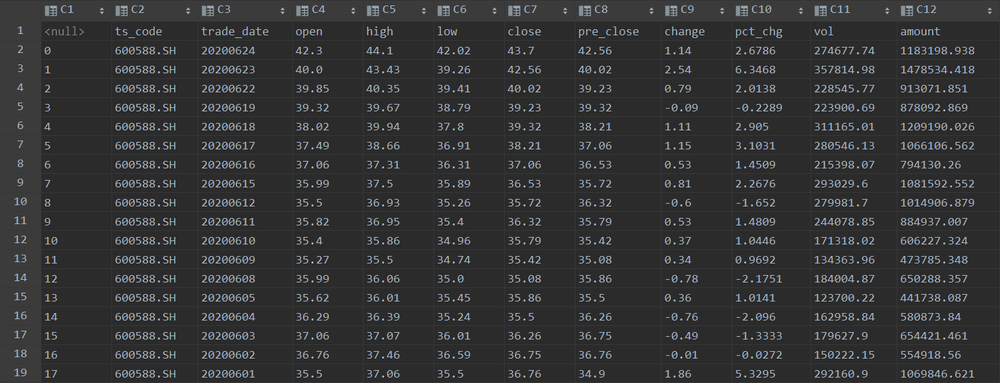
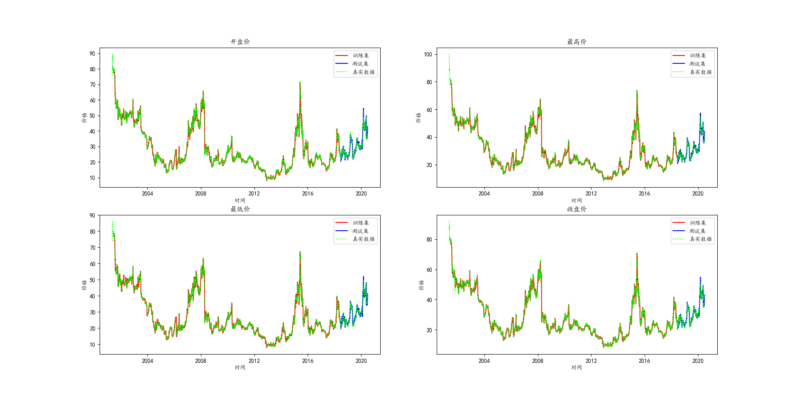
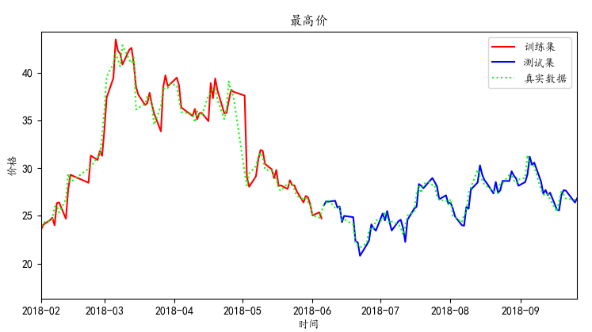

# 基于循环神经网络预测股价

## 一、数据获取
### 1.1 训练过程中所有的股票日K数据均来自`tushare`
```$xslt
import tushare

pro = ts.pro_api(token)
df = pro.daily(ts_code, start_date, end_date)
df.to_csv(filename)
```
## 二、 数据预处理
### 2.1 获取到的数据格式如图所示


### 2.2 特征选取
我选取了股票交易数据中几个有用的特征
|特征|说明|
|-|-|
|open|开盘价|
|high|最高价|
|low|最低价|
|close|收盘价|
|pre_close|昨日收盘价|
|chagne|涨跌额|
|pct_chg|涨跌幅|
|vol|成交量（手）|
|amount|成交额（千元）|

### 2.3 数据标准化或归一化
去除特征量纲，加速模型收敛，这里采用标准化处理。  


### 2.4 生成时间序列
这里选取`30`天为一个时间序列，来预估低`31`天的`开盘价`、`收盘价`、`最高价`和`最低价`
```
def series_data(df, n):
    """
    将数据组装成时间序列
    :param df: DataFrame对像
    :param n: 时间序列长度
    :return: data, label 数据和标签的numpy数组对象
    """
    data = []
    label = []
    for i in range(len(df) - n):
        d = df[i:n + i].values
        l = df[n + i:n + i + 1][["open", "high", "low", "close"]].values
        data.append(d)
        label.append(l)
    return np.array(data), np.array(label)
```


## 三、神经网络结构
### 3.1 简单起见，这里采用一层循环的`LSTM` + 全连接的输出层。


### 3.2 神经网络定义
```
class RNN(torch.nn.Module):
    def __init__(self, input_size):
        """
        循环神经网络实现，采用LSTM
        :param input_size: 输入的特征维度
        """
        super(RNN, self).__init__()
        self.rnn = torch.nn.LSTM(
            input_size=input_size,
            hidden_size=64,
            num_layers=1,
            batch_first=True
        )
        self.out = torch.nn.Sequential(
            torch.nn.Linear(64, 4)
        )

    def forward(self, x):
        """
        前向传播
        :param x: 输入数据
        :return:
        """
        r_out, (h_n, h_c) = self.rnn(x, None)
        out = self.out(r_out)
        return out
```
### 3.3 输入输出维度
#### 输入
格式：（batch_size, series_length, input_dim)  
实际取值
|维度|说明|大小|
|-|-|-|
|batch_size|批大小|10|
|series_length|序列长度|30|
|input_dim|特征维度|9|
#### 输出
格式：（batch_size, series_length, output_dim)  
实际取值
|维度|说明|大小|
|-|-|-|
|batch_size|批大小|10|
|series_length|序列长度|30|
|input_dim|特征维度|4|

>实际取最后一个序列的输出与`label`进行损失计算

## 四、训练网络
略

## 五、验证
  
选取最高价的局部大图看一下  
  
可以看到不管是训练集还是测试集都拟合完美，具体效果如何等待验证，个人感觉中长线趋势还是挺准的，短线偶尔也有一定的误差。